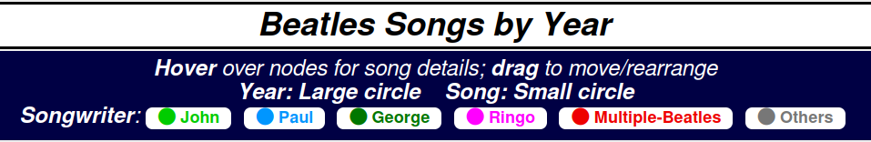

# Beatles

### D3.js visualization of Beatles Songs by Year

The contents of this dir are static & self-contained.

Just copy the following files to a directory served by any web-server
(or even a local dir on your computer) and the application should be live:

  - [index.html](index.html)
  - [force-directed-graph.js](force-directed-graph.js)
  - [d3.v3.min.js](d3.v3.min.js)
  - [Beatles.json](Beatles.json)

## How to use

Just follow the quick help at the top of the screen:

## Live Demo

github doesn't allow iframes in README.md for security reasons.

So you need to follow the link to see the app deployed:

[visualization of Beatles Songs by Year (live demo)](https://yendor.com/Beatles/)

## Credits:

  - *Ori Faigon:* ideas, design, inspiration, data curation
  - *Ariel Faigon:* connecting the dots
  - *Mike Bostock:* [D3.js](https://d3js.org)
  - *Vladan Devedzic:* [data-set @ github](https://github.com/inteligentni/Class-05-Feature-engineering)
